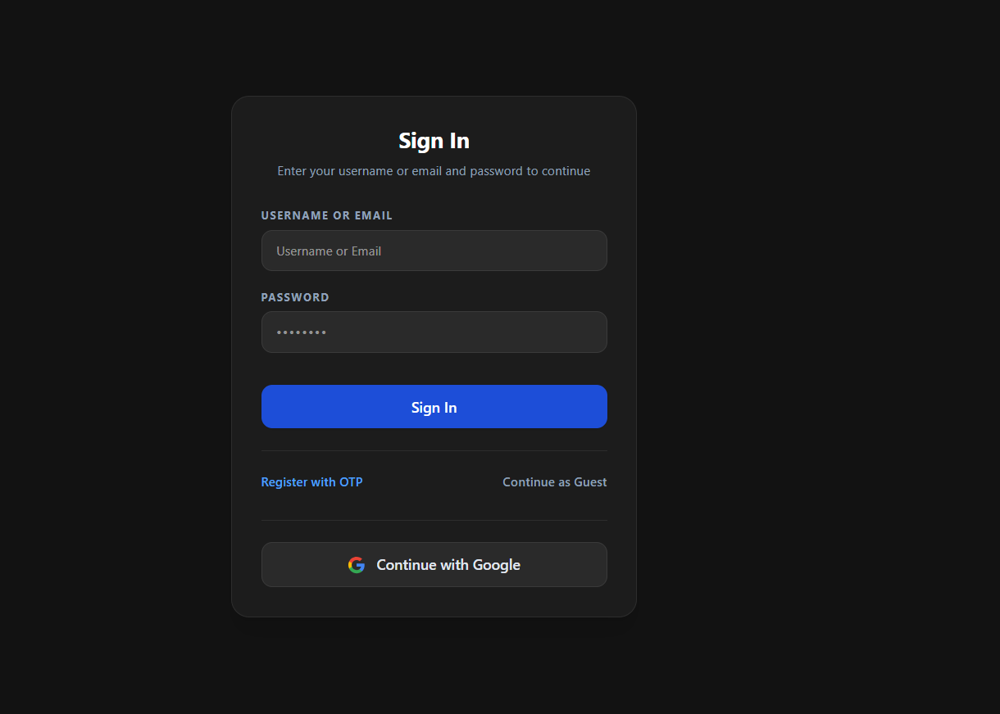
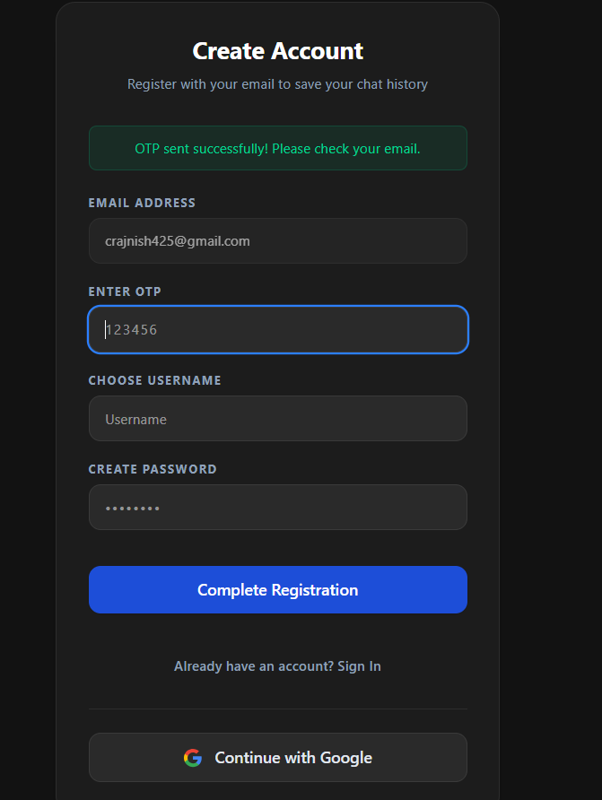
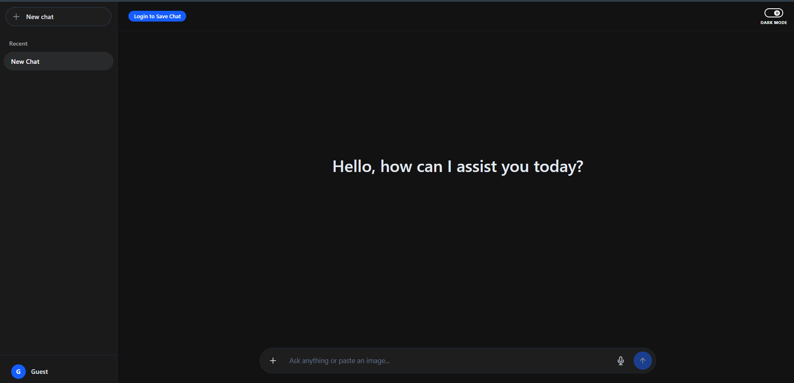
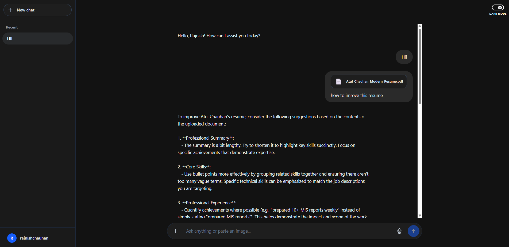
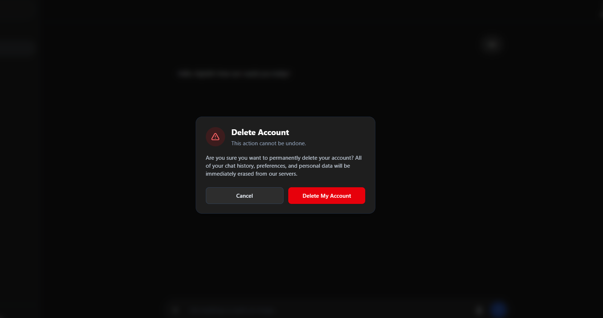
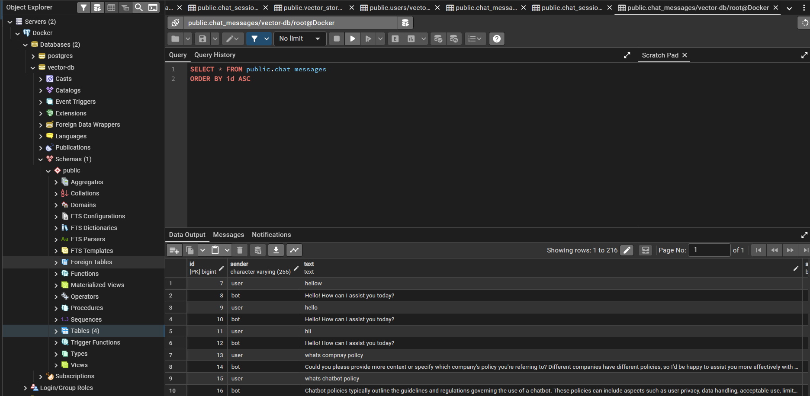

# Enterprise Multimodal RAG Chatbot


An enterprise-ready, full-stack conversational AI platform integrating **Retrieval-Augmented Generation (RAG)**, **Multimodal Vision Intelligence**, **Automated Document Ingestion**, and **Real-Time Web Search**. 

Architected with **Java 21**, **Spring Boot**, **Spring AI**, **PostgreSQL (PGVector)**, and a reactive **React 19 + Tailwind CSS v4** interface, this platform delivers production-grade capabilities including dual-tier token-bucket rate limiting (Bucket4j), secure hybrid authentication (JWT & Google OAuth2), automated evaluation against AI hallucinations, and real-time streaming via Server-Sent Events (SSE).

---

## Key Features

### 1. Intelligent Multimodal AI & RAG Engine
- **Vector Search Grounding (PGVector):** Executes semantic similarity queries (`HNSW` / cosine distance) against vectorized enterprise knowledge bases to provide context-accurate, verifiable answers.
- **Deep Document Ingestion:** Automated semantic extraction across heterogeneous file formats (PDFs, TXT, Word `.docx`) powered by Apache Tika and Spring AI native token splitters.
- **Multimodal Computer Vision:** Seamless multi-file image analysis using OpenAI Vision models (`gpt-4o-mini`), enabling simultaneous text extraction and visual diagram analysis.
- **Real-Time Web Grounding:** Integrated Tavily Search fallback to retrieve real-time external data when queries exceed internal vector context.
- **Hallucination Evaluation Suite:** Integrated unit and LLM-as-a-Judge evaluators (`OpenAiLiveEvaluatorTest`) enforcing factual groundedness against source documents before response delivery.

### 2. Enterprise Security & Identity Management
- **Multi-Factor Hybrid Auth:** Dual authentication architecture supporting **Google OAuth2 OIDC** (with automated 60s clock-skew tolerance) and custom **Email/OTP** verification.
- **Password Safety & Visibility:** Dedicated password creation and confirmation workflows featuring live match validation and interactive visibility toggles.
- **Stateless JWT Security:** Tamper-proof, cryptographically signed tokens (`io.jsonwebtoken`) ensuring stateless authorization across microservices.
- **Frictionless Guest Access:** Zero-barrier guest testing sessions with instant migration paths to permanent registered accounts without data loss.

### 3. API Resilience & Operational Governance
- **Token-Bucket Rate Limiting (Bucket4j):** Dual-tier rate limiting preventing Denial-of-Service and controlling LLM API expenses (10 queries/day for guest tiers, 100 queries/day for verified users).
- **Graceful Failure & In-App Alerts:** Replaces disruptive browser alerts with non-blocking, accessible in-app toast notifications for file size caps (10MB limit) and upload thresholds.
- **Data Privacy & GDPR Compliance:** Cascading lifecycle deletion allowing users to permanently purge accounts, associated chat sessions, and vectorized records in one click.

### 4. Modern, Developer-Centric User Interface
- **Markdown & Syntax Highlighting:** Full markdown support for headings, tables, and blockquotes with syntax-colored code blocks (Prism / VS Code Dark Plus theme).
- **Integrated Code Tools:** One-click clipboard copy and direct source code snippet downloads mapped to appropriate file extensions (`.java`, `.py`, `.js`, etc.).
- **Dynamic Multiline Input:** Auto-expanding chat input with `Shift + Enter` multiline newline support, hidden native scrollbars, and fluid speech-to-text dictation.
- **Persistent Theme Synchronizer:** Persistent Dark/Light theme switching synchronized across tabs and reloads, eliminating Flash of Unstyled Content (FOUC).

---

## Application Gallery

### Authentication & Access Control
| Standard Login | OTP Registration | Guest Mode Access |
|:---:|:---:|:---:|
|  |  |  |

### AI Interaction & Infrastructure
| Multimodal Chat Interface | Account Deletion (Danger Zone) | Vector Database (Pgvector) |
|:---:|:---:|:---:|
|  |  |  |

---

## System Architecture

```text
[ React 19 Frontend (Vite / Nginx) ]
                │
                ├── SSE Streaming & REST API Calls (JWT Bearer)
                ▼
[ Spring Boot 3.x / 4.x Application Gateway ]
        │                       │
        ├── RateLimitFilter      ├── JwtAuthenticationFilter
        │   (Bucket4j Tokens)   │   (Spring Security OIDC)
        ▼                       ▼
┌────────────────────────────────────────────────────────┐
│               Spring AI Orchestration Core             │
│                                                        │
│  ┌──────────────────────┐    ┌──────────────────────┐  │
│  │  Apache Tika Reader  │    │ VectorStore RAG Hub  │  │
│  │ (PDF / DOCX Parsing) │    │  (Semantic HNSW TopK)│  │
│  └──────────────────────┘    └──────────────────────┘  │
│             │                            │             │
│             └─────────────┬──────────────┘             │
│                           ▼                            │
│           Prompt Synthesis & Media Attachments         │
└───────────────────────────┬────────────────────────────┘
                            │
            ┌───────────────┴───────────────┐
            ▼                               ▼
 [ OpenAI API (gpt-4o-mini) ]     [ Tavily Real-Time Web Search ]
```

---

## Technology Stack

| Domain | Technology / Library | Purpose |
| :--- | :--- | :--- |
| **Backend Runtime** | Java 21 (LTS), Spring Boot | High-concurrency enterprise backend foundation |
| **AI Framework** | Spring AI, OpenAI GPT-4o-mini | Unified LLM abstraction, vision input, streaming |
| **Vector Database** | PostgreSQL + PGVector (`HNSW`) | High-dimensional embeddings and semantic similarity |
| **Document Parsing**| Apache Tika, PagePdfDocumentReader | Deep textual extraction from binary documents |
| **API Protection**  | Bucket4j | In-memory token bucket rate limiting per user/IP |
| **Security & Auth** | Spring Security 6, JJWT, Google OAuth2 | Dual-path authorization (OIDC Google login & JWT) |
| **Frontend Core**   | React 19, Vite | Responsive Single Page Application (SPA) architecture |
| **Styling & Icons** | Tailwind CSS v4, Custom SVG Sprites | Adaptive design with persistent dark/light theme |
| **Code Rendering**  | React-Markdown, Remark-GFM, Prism | Syntax highlighting, code copy, and file downloads |
| **Containerization**| Docker, Docker Compose | Reproducible local & production environment orchestration |

---

## Getting Started

### Prerequisites
- **JDK 21+** installed and configured on your environment path
- **Node.js (v20+ LTS)** and **npm**
- **Docker & Docker Compose** for database and container services
- **OpenAI API Key** and **Tavily Search API Key**

---

### Step 1: Database Setup (PostgreSQL with PGVector)

Start the PostgreSQL container configured with vector extensions:

```bash
docker run -d --name vector-db \
  -e POSTGRES_USER=root \
  -e POSTGRES_PASSWORD=root \
  -e POSTGRES_DB=vector-db \
  -p 5432:5432 \
  ankane/pgvector:latest
```

---

### Step 2: Environment Configuration

Create an environment configuration file (`.env` or configure `src/main/resources/application.properties`):

```properties
# Server Configuration
SERVER_PORT=8080

# Database Configuration
SPRING_DATASOURCE_URL=jdbc:postgresql://localhost:5432/vector-db
SPRING_DATASOURCE_USERNAME=root
SPRING_DATASOURCE_PASSWORD=root
SPRING_JPA_HIBERNATE_DDL_AUTO=update

# Vector Store Engine
SPRING_AI_VECTORSTORE_PGVECTOR_INITIALIZE_SCHEMA=true
SPRING_AI_VECTORSTORE_PGVECTOR_DIMENSIONS=1536
SPRING_AI_VECTORSTORE_PGVECTOR_DISTANCE_TYPE=COSINE_DISTANCE

# LLM & Web Grounding Keys
OPENAI_API_KEY=sk-proj-your-openai-api-key
TAVILY_API_KEY=tvly-your-tavily-api-key

# Google OAuth2 Authentication
GOOGLE_CLIENT_ID=your-client-id.apps.googleusercontent.com
GOOGLE_CLIENT_SECRET=GOCSPX-your-client-secret

# Email Verification (Gmail SMTP)
GMAIL_USERNAME=your-verified-email@gmail.com
GMAIL_APP_PASSWORD=your-16-character-app-password

# Client & CORS Governance
FRONTEND_URL=http://localhost:5173
CORS_ALLOWED_ORIGINS=http://localhost:5173,https://your-domain.vercel.app
```

---

### Step 3: Build & Run Backend

Execute tests and launch the Spring Boot service:

```bash
# Run unit & evaluation tests
./mvnw clean test

# Run application
./mvnw spring-boot:run
```

The REST API and SSE streaming endpoints will bind to `http://localhost:8080`.

---

### Step 4: Run Frontend Client

From the frontend root directory:

```bash
# Install dependencies
npm install

# Start development server
npm run dev
```

The web application will launch at `http://localhost:5173`.

---

## Production Deployment & CI/CD

### Containerized Deployment (Docker Compose)
Launch the unified multi-container system (Database, Backend API, and Nginx-proxied Frontend):

```bash
docker compose up --build -d
```


---

## 👨‍💻 Author

**Rajnish Chauhan**  
*Java Backend & AI Integration Engineer*

- 🌐 **Portfolio:** [rajnishsystems.in](https://rajnishsystems.in)
- 💼 **LinkedIn:** [linkedin.com/in/rajnishchauhan](https://www.linkedin.com)
- 🐙 **GitHub:** [github.com/rajnish425](https://github.com/rajnish425)
